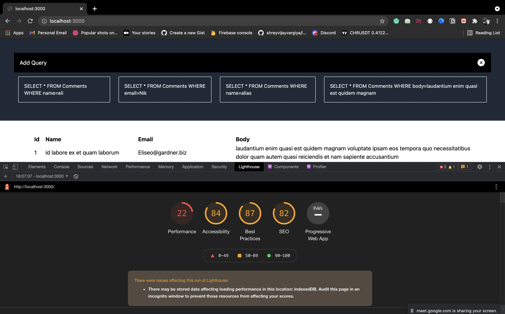

<h1>SQL Editor for Atlan project</h1>

<h3>References</h3>

Read the article for better understanding

Performace & Page Load Time

 

The tool I am using is google chrome lighthouse as shown in the image above. The performance upto 25% which is not quite good and we really need to improve it 

<strong>We can improve the performance by implementing the following ways</strong>
<ol>
  <li>We are fetching almost 500 key value pairs instead we can add pagination in the API to fetch only the required data at a time let say 50-100 comments</li>
  <li>Adding lazy loading for the remaining fetched comments will improve the application performance</li>
  <li>By avoiding unnecessary re-rendering will improve the performance a lot</li>
  <li>Caching the API data to avoid re-fetching data will again the performance></li>
</ol>
